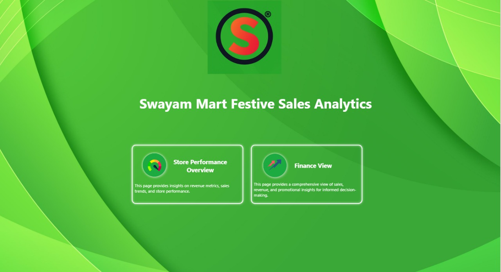
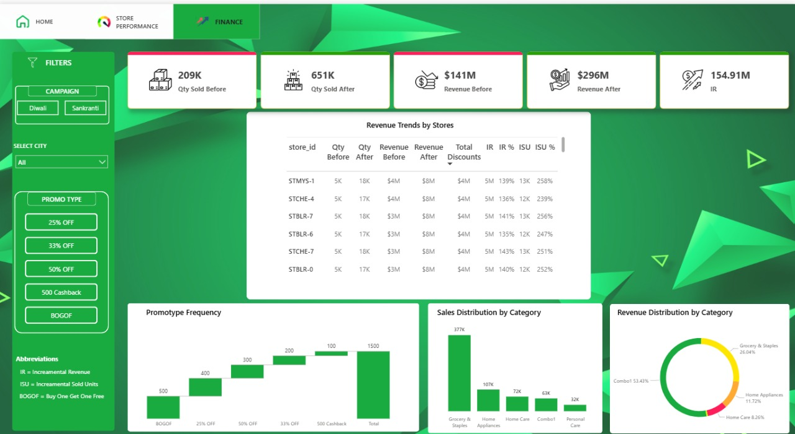
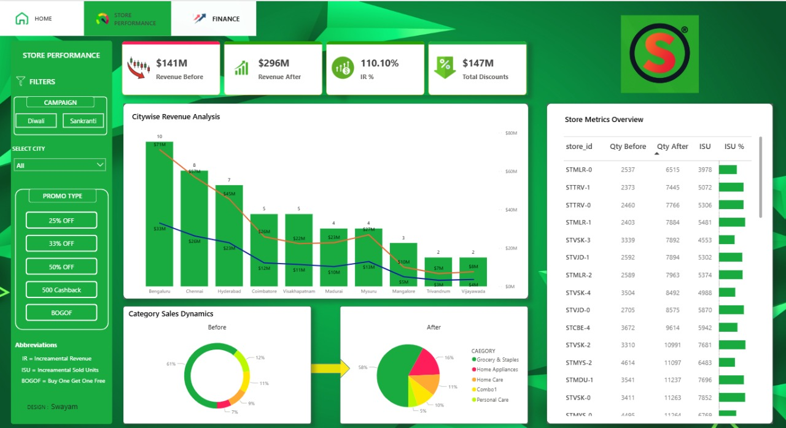

# Swayam Mart’s Diwali & Sankranti Promotions!

This repository contains the SQL scripts used to analyze the performance of promotional campaigns run by Swayam Mart during Diwali 2023 and Sankranti 2024. The project addresses various business requests related to identifying high‑value discounted products, store distribution, campaign effectiveness, and product performance in terms of incremental sales and revenue.

## Introduction

Promotional campaigns play a crucial role in the retail industry, driving sales and attracting customers during festive seasons. This project aims to analyze the performance of promotional campaigns conducted by Swayam Mart during Diwali 2023 and Sankranti 2024. By leveraging data analytics, we seek to gain insights into the effectiveness of these campaigns and provide recommendations for optimizing future marketing strategies.

## Data Sources

The analysis is based on data obtained from Swayam Mart's internal databases. The main datasets used include `fact_events`, `dim_products`, `dim_stores`, and `sales_summary`. These datasets contain information about product sales, store locations, promotional events, and campaign revenues.

## Project Overview

1. **Analyzed** data from Swayam Mart's internal databases.
2. **Performed** SQL queries to fulfill five business requests.
3. **Generated insights** to inform future promotional strategies and resource allocation.

## Screenshots

| Page 1 | Page 2 | Page 3 |
|:------:|:------:|:------:|
|  |  |  |

## Business Requests

### 1 • High‑Value Products in **BOGOF** Promotion

**Objective:** Identify high‑value products featured in the **BOGOF** (Buy One Get One Free) promotion.

```sql
SELECT DISTINCT
    p.product_name,
    f.base_price
FROM
    fact_events AS f
    JOIN dim_products AS p ON f.product_code = p.product_code
WHERE
    f.promo_type = 'BOGOF'
      AND f.base_price > 500;
```

### 2 • Store Presence Overview

**Objective:** Provide an overview of the number of stores in each city.

```sql
SELECT
    city,
    COUNT(store_id) AS total_stores
FROM dim_stores
GROUP BY city
ORDER BY total_stores DESC;
```

### 3 • Promotional Campaign Revenue Analysis

**Objective:** Display total revenue generated **before** and **after** each promotional campaign.

```sql
SELECT
    campaign_name,
    CONCAT(ROUND(SUM(revenue_before) / 1_000_000, 2), 'M') AS revenue_before,
    CONCAT(ROUND(SUM(revenue)         / 1_000_000, 2), 'M') AS revenue_after
FROM sales_summary
GROUP BY campaign_name;
```

### 4 • Incremental Sold Quantity (ISU %) — Diwali Campaign

**Objective:** Calculate Incremental Sold Quantity (ISU %) for each category during the Diwali campaign.

```sql
SELECT
    category,
    isu_percent,
    RANK() OVER (ORDER BY isu_percent DESC) AS ranking
FROM (
    SELECT
        category,
        SUM(ISU)                                          AS isu,
        ROUND(SUM(ISU) / SUM(quantity_before_promo) * 100, 2) AS isu_percent
    FROM sales_summary
    WHERE campaign_name = 'Diwali'
    GROUP BY category
) AS subq;
```

### 5 • Top 5 Products by Incremental Revenue Percentage (IR %)

**Objective:** Identify the top 5 products ranked by Incremental Revenue Percentage (IR %) across all campaigns.

```sql
SELECT
    product_name,
    category,
    ROUND(SUM(IR) / SUM(revenue_before) * 100, 2) AS ir_percent,
    RANK() OVER (ORDER BY SUM(IR) / SUM(revenue_before) * 100 DESC) AS ranking
FROM sales_summary
GROUP BY product_name, category
ORDER BY ir_percent DESC
LIMIT 5;
```

## Limitations and Challenges

A key limitation emerged when analyzing promotions with the **BOGOF** promotion type. The dataset does not accurately record the quantity of the free item provided, which may lead to discrepancies when evaluating the effectiveness of **BOGOF** promotions versus other promotion types.

## Results and Insights

* High‑value products featured in **BOGOF** promotions.
* Distribution of stores across different cities.
* Total revenue generated before and after each promotional campaign.
* Incremental sold quantity and revenue percentage during the Diwali campaign.
* Top 5 products ranked by incremental revenue percentage.

These insights can guide Swayam Mart in optimizing future promotional activities, resource allocation, and overall sales performance.

## Conclusion

This analysis delivers actionable insights into the performance of Diwali 2023 and Sankranti 2024 promotional campaigns. Leveraging these findings, Swayam Mart can refine marketing strategies, attract more customers, and boost festive‑season sales.

## Additional (Recommended) Analyses

### Store Performance
* **Top 10 stores by Incremental Revenue (IR)**
* **Bottom 10 stores by Incremental Sold Units (ISU)**
* **City‑wise performance comparison**

### Promotion Type Performance
* **Top 2 promotion types by Incremental Revenue**
* **Bottom 2 promotion types by Incremental Sold Units**
* **Discount vs. BOGOF vs. Cashback effectiveness**

### Product & Category Insights
* **High‑lifting categories** during promotions
* **Product responsiveness** to different promotion types
* **Category × Promotion type** correlations

## Future Work

* Incorporate additional datasets to unlock deeper customer insights.
* Conduct more granular analyses at product‑category or regional levels.
* Explore machine‑learning models for predictive sales forecasting and promotion optimization.
